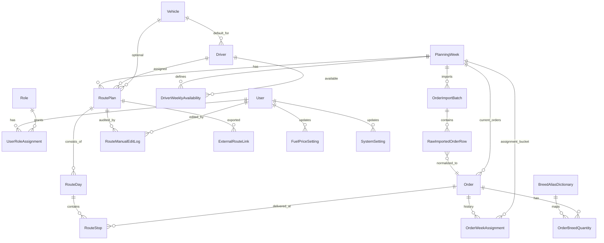

# Trasa — ERD (model domenowy)

## Najważniejsze relacje

1. `PlanningWeek` jest wersjonowany przez parę (`weekStartDate`, `version`) oraz referencję `previousVersionId`.
2. `Order` ma dwie reprezentacje: surową (`RawImportedOrderRow`) i znormalizowaną (`Order` + `OrderBreedQuantity`).
3. Przenoszenie zamówień między tygodniami jest zapisywane historycznie w `OrderWeekAssignment` (`isCurrent`, `assignedAt`, `unassignedAt`).
4. `RoutePlan` jest unikalny dla pary (`planningWeekId`, `driverId`) i posiada metryki (`totalKm`, `totalDurationMin`, `totalFuelCost`, itd.).
5. `RouteDay` i `RouteStop` modelują dzień i kolejność realizacji (`dayIndex`, `sequenceNo`) z metrykami dziennymi i odcinkowymi.
6. Każda ręczna zmiana trasy trafia do `RouteManualEditLog` z `beforeJson` i `afterJson`.
7. `ExternalRouteLink` przechowuje identyfikatory/URL tras z systemów zewnętrznych.
8. `FuelPriceSetting` i `SystemSetting` zapewniają konfigurację kosztów i parametrów systemowych z informacją, kto zmienił wartość.
